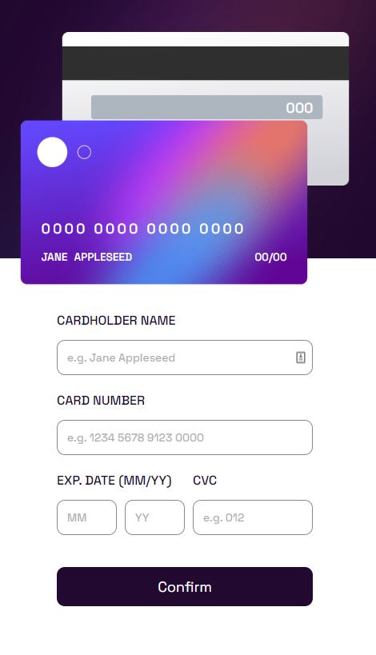
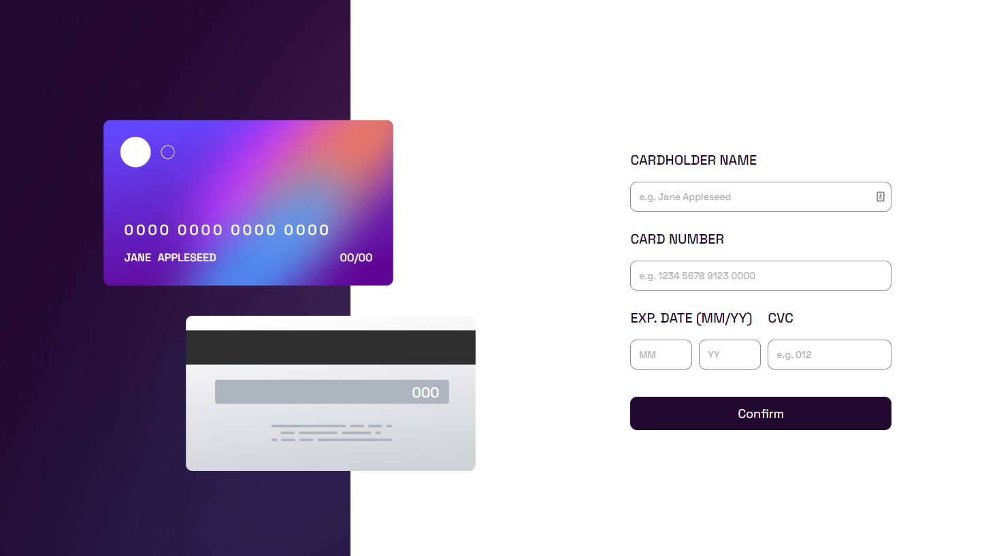
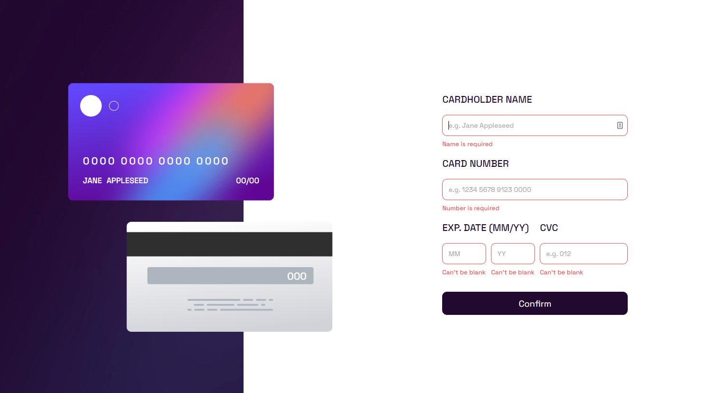

# Frontend Mentor - Interactive card details form solution

This is a solution to the [Interactive card details form challenge on Frontend Mentor](https://www.frontendmentor.io/challenges/interactive-card-details-form-XpS8cKZDWw). 

## Overview

### The challenge

Users should be able to:

- Fill in the form and see the card details update in real-time
- Receive error messages when the form is submitted if:
  - Any input field is empty
  - The card number, expiry date, or CVC fields are in the wrong format
- View the optimal layout depending on their device's screen size
- See hover, active, and focus states for interactive elements on the page

### Expected behaviour

 - Update the details on the card as the user fills in the fields
 - Validate the form fields when the form is submitted
 - If there are no errors, display the completed state
 - Reset the form when the user clicks "Continue" on the completed state

### Screenshots

### Links

- Live Site URL: https://alicja1bobko.github.io/Interactive-Card/

## My process

### Built with

- CSS custom properties
- Flexbox
- CSS Grid
- Mobile-first workflow
- Typescript
- [React Hook Form ](https://react-hook-form.com/)

### What I learned

This challenge was a great way to dive slowly into Typescript for more complex application. I've build a form with React Hook Form, with yupResolver and [Credit Card Validator](https://www.npmjs.com/package/card-validator) for the first time. I've faced many problems with css animations and giving input with border radius property a gradient outline. It was also a great way to review knowledge in Regex by field validation. 
